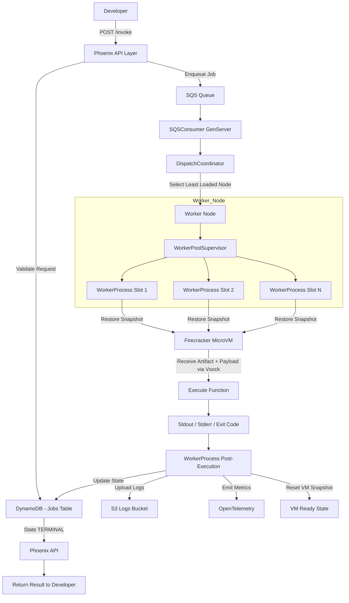

# Terrarium


[](https://elixir-lang.org/)
[](https://aws.amazon.com/sqs/)
[](https://opensource.org/licenses/MIT)

A resilient serverless execution engine built with Elixir/OTP scheduling and Firecracker microVM isolation.

Infinity Node is designed to run untrusted workloads safely at scale. Scheduling, retries, and crash recovery are handled by OTP supervision trees, while each execution happens in a microVM boundary.

## Table of Contents
- [Architecture Philosophy](#architecture-philosophy)
- [Key Features](#key-features)
- [System Architecture](#system-architecture)
- [Repository Layout](#repository-layout)
- [Prerequisites](#prerequisites)
- [Getting Started](#getting-started)
- [Validation on Metal](#validation-on-metal)
- [Contributing](#contributing)
- [License](#license)

## Architecture Philosophy

At the core of Infinity Node is the Elixir BEAM process model. Serverless scheduling is treated as a distributed concurrency problem, and failures are recovered structurally through supervisors instead of ad hoc recovery logic.

## Key Features

- Strict execution isolation with Firecracker microVMs.
- Snapshot-based execution model to reduce cold start overhead.
- OTP-native worker orchestration and restart semantics.
- S3-backed log capture for stdout and stderr artifacts.
- Security controls through cgroups, private network namespaces, and seccomp modes.

## System Architecture

1. Ingress: jobs are accepted and queued.
2. Coordination: scheduler components select an available worker slot.
3. Execution: worker restores runtime state, injects artifact and payload, executes, and collects output.
4. Egress: result envelope and log pointers are returned to the caller.



## Repository Layout

```text
apps/
    api/
    scheduler/
    worker/
rust/
    jailer/
scripts/
config/
```

## Prerequisites

- Elixir 1.16+
- Erlang/OTP 26+
- Rust toolchain
- Firecracker and KVM-capable Linux host for runtime validation
- AWS credentials with access to required buckets and queue infrastructure

## Getting Started

1. Clone and switch to development branch.

```bash
git clone https://github.com/Krishang-Zinzuwadia/diva-lopers.git
cd diva-lopers
git checkout dev
```

2. Install dependencies and run tests.

```bash
mix deps.get
mix test apps/worker/test
```

3. For Linux metal-host bootstrap and validation, use scripts in `scripts/`.

## Validation on Metal

Run these on Ubuntu bare-metal EC2 (i3.metal or c5.metal):

```bash
./scripts/bootstrap_ubuntu_worker.sh
./scripts/create_snapshot.sh
./scripts/validate_isolation.sh
./scripts/run_snapshot_fidelity.sh
./scripts/phase5_validate.sh
```

## Contributing

1. Create changes on `dev`.
2. Keep commits atomic and use conventional prefixes such as `feat`, `fix`, and `chore`.
3. Run relevant tests before pushing.

## License

MIT
